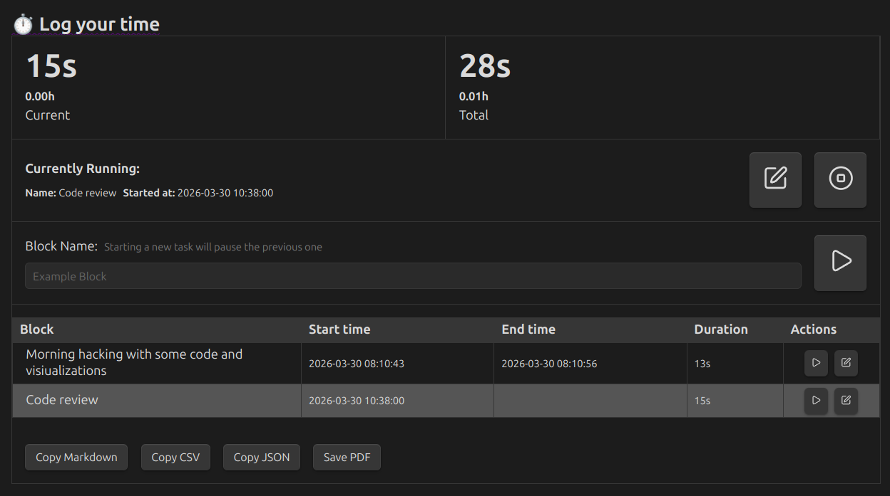
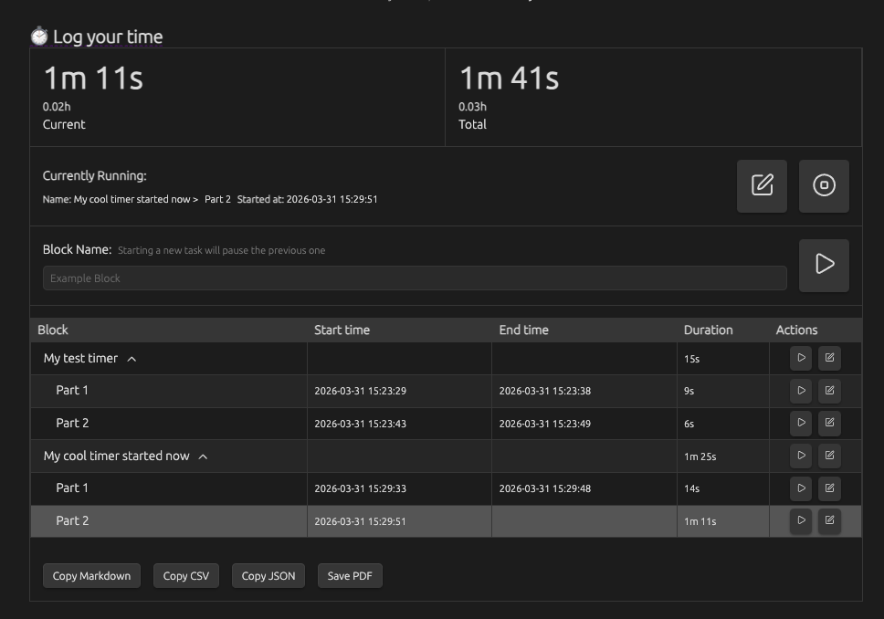

# TimeKeepSidian

A small shell utility I wrote for injecting [TimeKeep](https://github.com/Tarkin25/obsidian-timekeep) timer entries directly into your Obsidian Daily Note page from the commandline without the need to interact with the Obsidian interface at all. For those of us who have multiple workspaces, Obsidian may be buried 3 levels beneath other running apps.

## What it does

If you use the TimeKeep plugin in Obsidian and keep a Daily Note, this script lets you start, pause, and resume named timers from the commandline. 

It finds today's note by parsing your Obsidian configuration, locates the `timekeep` code block in that note, stops any currently running timer, and either appends a new entry, pauses the running timer, or resumes the last stopped entry, depending on options you pass to the script.

This is super handy when you're already in a terminal and don't want to context switch just to click a button in the Obsidian inteface.





## Requirements

- Python 3.9 or later
- [Pendulum](https://pendulum.eustace.io/) (`pip install pendulum`)
- Obsidian with the [TimeKeep plugin](https://github.com/Tarkin25/obsidian-timekeep) installed
- A daily note that contains a `timekeep` fenced code block (see Setup below for the exact format of that TimeKeep code block)

## Setup

Clone this repository and install the only dependency we need:


* Bare pip install
    ```bash
    pip install pendulum
    ```

* If you're on Ubuntu
    ``` bash
    sudo apt -y install python3-pendulum
    ``` 

* Other distros
    ``` bash
    sudo dnf install python3-pendulum
    ```


The script also needs to know where your Obsidian vault lives. Set `VAULT_PATH` in your environment:

```bash
export VAULT_PATH="/home/me/docs/obsidian-notes"
```

Drop that in your `.bashrc` / `.zshrc` so you don't have to think about it. Alternatively, pass the path directly at runtime with the `-v` option (see Usage section below).

The daily note folder and filename format are read automatically from your vault's `$VAULT_PATH/.obsidian/daily-notes.json` file, so no configuration is needed here, no tricky date parsing or mangling required.

One note: Make sure your `timekeep` block in your Daily Note has this exact structure and format as a template:

    ```timekeep
    { "entries": [] }
    ```

The empty list value is important, so it cna be populated with your timers when injected with this script.


## Usage

```
python3 inject-time.py [-v PATH] [-p | -r] [name]
```

| Option | Description |
|---|---|
| `name` | Name for the new timer entry (default: `New Task` if unspecified). |
| `-v`, `--vault PATH` | Path to your Obsidian vault, this will override `$VAULT_PATH` if you have both set. |
| `-p`, `--pause` | Stop the running timer if found, without starting a new one. |
| `-r`, `--resume` | Resume the last stopped timer under its original name. |

`-p` and `-r` are mutually exclusive, and can't be used together (that should be obvious, you can't both pause and resume a timer at the same time)

### Start a timer

This will stop any currently running timer at the same timestamp the new one starts, keeping your time accounting clean.

```bash
python3 inject-time.py "Code review"
# Started 'Code review' in /home/me/docs/obsidian-notes/Daily Notes/2026-03-31-Tuesday.md
```


### Start a timer with an explicit vault path

This is useful for ad-hoc script runs or if you work with multiple vaults in a single Obsidian instance ("Personal" vs. "Work" vaults for example)

```bash
python3 inject-time.py -v /home/me/docs/obsidian-notes "Code review"
# Started 'Code review' in /home/me/docs/obsidian-notes/Daily Notes/2026-03-31-Tuesday.md
```


### Pause the running timer you already started

Sets `endTime` on the running entry and creates nothing new. If no timer is running, it will return a message and exit cleanly.


```bash
python3 inject-time.py -p
# Paused 'Code review' in /home/me/docs/obsidian-notes/Daily Notes/2026-03-31-Tuesday.md
```


### Resume the last timer you started

This will finds the most recently-stopped timer by name and opens a new running entry with the same name. Useful after a break or a pause.

```bash
python3 inject-time.py -r
# Resumed 'Code review' in /home/me/docs/obsidian-notes/Daily Notes/2026-03-31-Tuesday.md
```




Note that when you pause and resume existing timers, they will be summarized in 'parts', just like they would if you were using TimeKeep directly from the Obsidian UI.


### Timer create, pause, resume workflow

```bash
python3 inject-time.py "Deep work"   # start
python3 inject-time.py -p            # pause for a meeting
python3 inject-time.py -r            # resume where you left off
python3 inject-time.py "Standup"     # switch to a different task
```

## How it works

The script reads your Daily Note from your Obsidian configuration, finds the `timekeep` JSON block in that note using a bit of a toothy regex, parses that JSON, closes any open entry, and writes the updated block back. 

The Daily Note path is derived from your Obsidian settings — it reads `$VAULT_PATH/.obsidian/daily-notes.json` for the folder and filename format (Obsidian uses Moment.js datetime tokens), so it stays in sync with however you have Obsidian configured. Nothing touches the network or cloud in any way.

## Notes

- Timestamps are always stored in UTC, exactly what the TimeKeep plugin expects.
- The script exits with an error if `VAULT_PATH` is not set or `-v` is not passed.
- The script exits with an error if the note file doesn't exist or if no `timekeep` block is found in your Daily Note.

## License

Do whatever you want with it, but PRs and suggesions are welcome! Special thanks to Jake N. for the recent ideas to improve this even further! 
